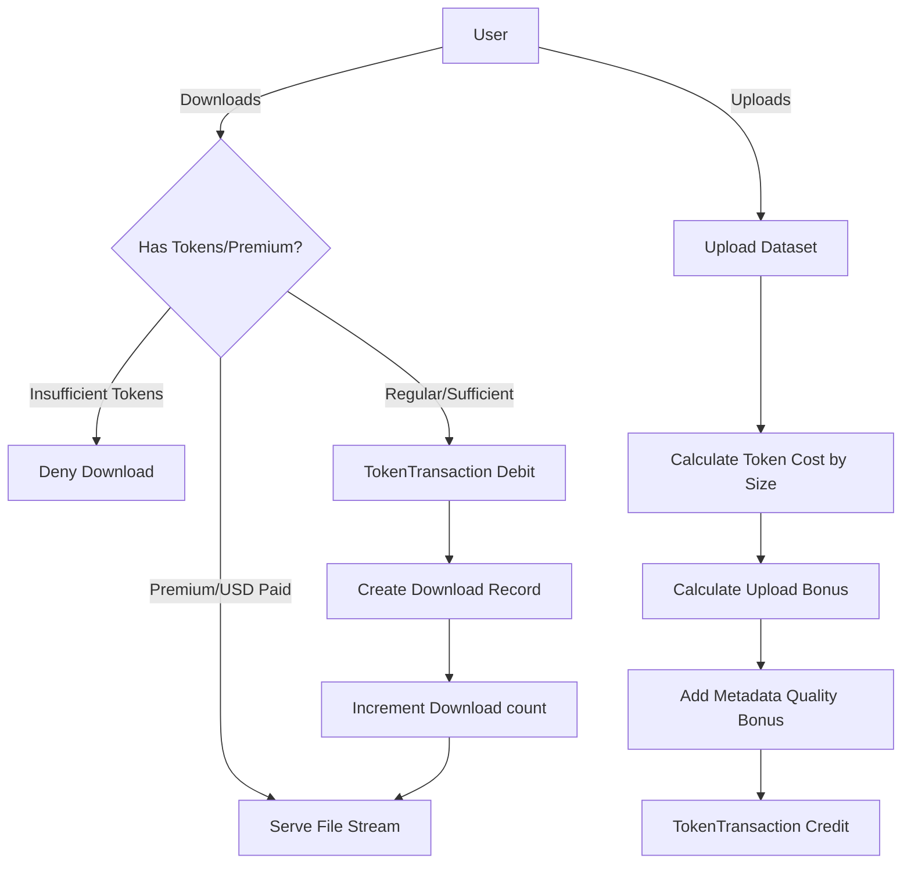

# 🛢️ AfriData – Data Storage & Token System Architecture

This document provides a guide to the database models, token economics, download controls, and premium purchase logic in the **AfriData core storage application** (`dataset/`).

---

## 📌 Architectural Overview

The core data storage system manages physical dataset file storage, metadata details, user downloads, and the platform’s internal **Token Economy**. It operates as a Django application backed by PostgreSQL (or SQLite locally) and handles token credits/debits, premium paywalls (USD via Stripe), and quality-score bonuses.



---

## 🧱 Database Models

The `dataset` application defines six primary models tracking storage and ledger transactions:

### 1. `Dataset`
* Represents a stored dataset file and its metadata.
* **Fields**:
  * `file`: Uploaded file stored in `datasets/` (db column: `file_path`).
  * `dataset_type`: Choice of `csv`, `excel`, `pdf`, `txt`, `json`, `xml`, `zip`, `yaml`, `parquet`, or `unstructured`.
  * `token_cost`: Calculated based on physical file size.
  * `is_premium`: Boolean flag indicating if this requires direct payment (Stripe USD).
  * `metadata_quality_score`: Value from `0.0` to `1.0` evaluating metadata completeness.
  * `quality_tier`: Choice of `basic`, `standard`, or `premium`.

### 2. `Comment`
* User reviews and discussion threads attached directly to a dataset.
* Supports community upvoting.

### 3. `TokenTransaction`
* The financial ledger tracking every user credit or debit.
* **Transaction Types**:
  * `signup_bonus`: Initial gift to new accounts.
  * `upload_bonus`: Reward for contributing datasets.
  * `download_cost`: Debit for retrieving a dataset.
  * `purchase`: User buying tokens via standard payment channels.
  * `quality_bonus` / `referral_bonus`: Promotional and performance credits.

### 4. `PremiumPurchase`
* Mappings of payments for paid (premium) datasets.
* Tracks purchase state (`pending`, `completed`, `failed`) and method (`usd_only`, `tokens_only`, or `hybrid`).

### 5. `Download`
* Tracks distinct download actions, preventing double-charging users who download the same dataset multiple times.

### 6. `Referral`
* Connects referrers with referred users, awarding bonus tokens.

---

## 💰 Token Cost & Bonus Mechanics

### 1. Download Cost Formula
Token costs are calculated dynamically on file save based on the size in Megabytes (MB):

| File Size (MB) | Token Cost |
| :--- | :--- |
| $< 10$ MB | **5** Tokens |
| $10$ to $49$ MB | **25** Tokens |
| $50$ to $124$ MB | **75** Tokens |
| $125$ to $349$ MB | **200** Tokens |
| $350$ to $559$ MB | **400** Tokens |
| $560$ to $1023$ MB | **700** Tokens |
| $1024$ to $1535$ MB | **1200** Tokens |
| $\ge 1.5$ GB | **1500** Tokens |

### 2. Upload Reward Formula
Users contributing high-quality data are rewarded with token credits:
* **Base Bonus**: `60%` of the dataset's standard download cost.
* **Documentation Bonus**: `+10` tokens if `has_documentation` is True.
* **Metadata Quality Bonus**:
  * `+20` tokens if `metadata_quality_score` $\ge 0.8$.
  * `+10` tokens if `metadata_quality_score` $\ge 0.6$.

---

## 🔒 Access & Download Control Logic

Access is evaluated in `can_user_download(user)`:
1. **Premium Checks**: If `is_premium` is `True`, check for a completed `PremiumPurchase` record.
2. **Regular Check**: If not premium, check the user's `token_balance` in their `UserProfile` profile. Balance must be $\ge$ the dataset `token_cost`.
3. **Download Deduplication**: If a `Download` record already exists for the user and dataset, the cost is skipped (download is free).

---

## ✅ Developer Checkpoints & Verification

Ensure you follow these rules when developing:

- [ ] **Transactions are Atomic**: Always wrap token transaction logic (e.g., deducting tokens and creating a `Download` record) in `transaction.atomic()` to avoid balance inconsistency if an error occurs.
- [ ] **Signal Validation**: Confirm that user profile token balances are modified only through standard `TokenTransaction` signals or transaction logic.
- [ ] Run the dataset test suite:
  ```bash
  python manage.py test dataset
  ```

> [!IMPORTANT]
> Never hardcode file size calculations in views. Always invoke `dataset.calculate_token_cost()` or write helper unit tests verifying boundary size mappings.
