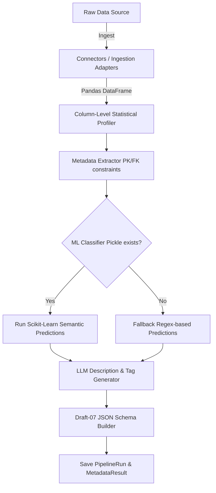

# 🤖 AfriData – Metadata Inferencing & Extraction Pipeline

This document provides a guide to the architecture, automated extraction pipeline, and machine-learning components of the **AfriData Metadata Extraction Pipeline** (`metadata/`).

---

## 📌 Architectural Overview

The metadata pipeline ingests data files, profiles columns, classifies semantic data types (e.g. emails, currencies), calls an LLM to generate plain-English descriptions, and exports an enriched **Draft-07 JSON Schema** for the dataset.



---

## 🧱 Repository Structure

```bash
metadata/
├── adapters/
│   ├── base_connector.py       # Abstract connector interface
│   ├── csv_connector.py        # Local/HTTP CSV file ingestion
│   ├── excel_connector.py      # Ingests Excel (.xlsx and .xls formats)
│   ├── sql_connector.py        # SQLAlchemy database extractor
│   └── s3_connector.py         # AWS S3 stream connector
├── core/
│   ├── pipeline.py             # Orchestrates connectors, profilers, and classifiers
│   ├── profiler.py             # Profiles null rates, cardinality, and sample records
│   ├── schema_builder.py       # Creates and validates Draft-07 JSON schemas
│   ├── extractors/             # Source-specific metadata extraction
│   └── enhancement/
│       ├── semantic_classifier.py  # ML-based classification engine
│       └── llm_generator.py        # Handles batched prompts for LLM descriptions
├── api/
│   ├── views.py                # REST endpoints
│   ├── serializers.py          # Serializers for pipeline runs
│   └── permissions.py          # DRF security rules (IsPipelineAdmin, etc.)
├── models.py                   # PipelineRun & MetadataResult models
└── tests/
    └── tests.py                # Unit & integration tests
```

---

## 🔄 Pipeline Execution Steps

### 1. Ingestion Adapters
Connectors load raw files into a standard Pandas DataFrame. Handled by format-specific modules in `adapters/` (CSV, Excel, SQL, AWS S3).

### 2. Statistical Profiling
The `Profiler` analyzes the DataFrame columns, calculating:
* Null percentages.
* Cardinallity (uniqueness).
* Typical sample values.

### 3. Semantic Classification
* **ML Engine**: Attempts to load a pretrained scikit-learn model from `metadata/ml_models/semantic_classifier.pkl`.
* **Fallback**: If the model is missing, the pipeline runs regex rules to classify common patterns (`email`, `currency`, `phone`, `date`).

### 4. LLM Description Generation
* To minimize api costs, the pipeline batches column profiles together and sends a single prompt to the LLM (Gemini, OpenAI, Anthropic, or Ollama).
* The LLM returns descriptions, tags, and human-friendly display names.

### 5. Schema Builder
Generates a valid **Draft-07 JSON Schema**:
```json
{
  "$schema": "http://json-schema.org/draft-07/schema#",
  "title": "Dataset Title",
  "type": "object",
  "properties": {
    "user_email": {
      "type": "string",
      "description": "The registered email address of the user.",
      "x-semantic-type": "email",
      "x-null-pct": 0.00
    }
  }
}
```

---

## 🔒 Security & API Access Control

Endpoints are secured with Django REST Framework (DRF) permission classes:
* `IsPipelineAdmin`: Restricts triggering new analysis runs or deleting results to users within the `pipeline_admin` group.
* `IsResultViewer`: Grants read-only access to completed metadata runs.
* `IsOwnerOrAdmin`: Restricts result views to the user who created the run (or super-users).

---

## ✅ Developer Checkpoints & Verification

- [ ] **Credential Handling**: Never write credentials directly into the database. `source_config` must reference environment variable keys, not actual passwords.
- [ ] **ML Pickle Fallback**: Verify that the classifier works correctly (via regex fallback) even if the `.pkl` ML model is deleted from the filesystem.
- [ ] Run the metadata test suite:
  ```bash
  python manage.py test metadata
  ```

> [!IMPORTANT]
> Never call `pipeline.run()` synchronously inside views, as LLM requests take time. Always offload the task using Celery and query `/api/metadata/runs/<id>/` for the status.
