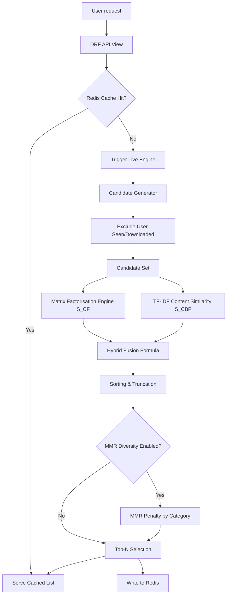

# 🧠 AfriData – Recommendations System Architecture

This document provides a comprehensive guide to the architecture, workflows, and developer checklist for the **AfriData Recommendations System** (`recommendations/`).

---

## 📌 Architectural Overview

The recommendation system delivers personalized dataset suggestions to authenticated users by fusing two distinct approaches into a **Weighted Hybrid Recommendation Engine**, supplemented with **Maximal Marginal Relevance (MMR)** diversity re-ranking and cached via **Redis** with **Celery** background training.



---

## 🧱 Directory Structure

```bash
recommendations/
├── domain/
│   ├── schemas.py              # Pure python dataclasses representing core boundaries
│   ├── evaluation.py           # Evaluation metrics: Precision@K, Recall@K, NDCG@K
│   ├── ranking.py              # Post-fusion rank sort and MMR diversity logic
│   └── engines/
│       ├── candidate_gen.py    # Excludes seen items, builds candidate item pool
│       ├── collaborative.py    # Scores candidates using SVD/ALS weights
│       ├── content_based.py    # Scores candidates via TF-IDF cosine similarity
│       └── hybrid.py           # Orchestrator: runs candidates, scores, fuses, and ranks
├── infrastructure/
│   ├── persistence.py          # Abstract DB layer — ONLY module allowed to load models.py
│   ├── model_store.py          # Save/load Collaborative Filtering model (joblib/S3)
│   ├── vector_store.py         # Save/load TF-IDF sparse matrices (scipy/S3)
│   └── cache.py                # Redis cache set/get operations
├── api/
│   ├── views.py                # DRF Endpoint handlers
│   ├── serializers.py          # Model serialisation mappings
│   └── urls.py                 # REST url routing
├── models.py                   # UserInteraction & RecommendationResult DB models
├── signals.py                  # Django DB hook triggers to invalidate Redis per-user
└── tasks.py                    # Celery tasks: training and cache invalidation
```

---

## ⚡ The Scoring & Fusion Formula

The core scoring engine fuses scores from Collaborative Filtering ($S_{CF}$) and Content-Based Filtering ($S_{CBF}$):

$$S_{\text{hybrid}} = \alpha \cdot S_{CF} + (1 - \alpha) \cdot S_{CBF}$$

### Configuration Parameters:
* **$\alpha$ (alpha)**: Configured via `RECOMMENDATIONS_ALPHA` in Django settings (default `0.5`). 
  * `1.0` is purely Collaborative (relies on user history).
  * `0.0` is purely Content-based (relies on dataset title/tag metadata).
* **Normalisation**: Scores are min-max normalised to the `[0, 1]` range before fusion.

### ❄️ Cold-Start Handling:
* **New User**: Returns $S_{CF} = 0.0$ for all items, falling back completely to metadata similarity ($S_{CBF}$) or global popularity metrics.
* **New Item**: Has no interaction history. Content similarity ($S_{CBF}$) matches it based on metadata text.

---

## 🔄 Diversity Re-ranking (MMR)

To prevent users from receiving recommendations of only one type (e.g., ten "finance" datasets in a row), the ranking system implements a **Maximal Marginal Relevance (MMR)** variant:
* **Penalty Function**: Consecutive candidate items falling within the same category/topic list are dynamically penalised.
* **Tuning**: Configured using `diversity_weight` in the `EngineConfig` settings.

---

## 📦 Infrastructure & Caching

### Redis Caching:
* **Key Format**: `rec:user:{user_id}`
* **Default TTL**: 1 Hour
* **Syncing**: Any modification to `UserInteraction` model (e.g., user rating or downloading a dataset) triggers a Django `post_save` or `post_delete` signal, dispatching an asynchronous Celery task to invalidate and rebuild the user's specific cache key.

### Model Storage Backends:
* Stored as serialized binaries (.pkl for models, .npz + .npy for matrices).
* Supports `local` storage (for development) and `s3` buckets (for production) controlled by `MODEL_STORE_BACKEND`.

---

## 🛠️ Management CLI Commands

For manual or automated pipeline execution:
```bash
# Fit collaborative filtering weights from interaction history
python manage.py train_collaborative --factors 50 --epochs 20 --evaluate

# Fit content-based TF-IDF matrices from dataset metadata
python manage.py train_content_based --max-features 10000

# Rebuild Redis cache scores for all active users
python manage.py rebuild_index
```

---

## ✅ Developer Checkpoints & Verification

When updating or extending the recommendations engine, verify the following:

### 1. Verification Checklist
- [ ] Run the complete integration tests suite using:
  ```bash
  python manage.py test recommendations
  ```
- [ ] Ensure test coverage remains **above 80%** across files in `domain/` and `infrastructure/`.
- [ ] **Rule of Pure Logic**: Confirm no Django ORM database queries are written inside `domain/` or the engines (`engines/`). All DB interactions must be mapped through `infrastructure/persistence.py`.
- [ ] **Celery Offloading**: Confirm that signal receivers do not run heavy calculations synchronously; they must spawn `refresh_user_scores.delay(user_id)`.

> [!WARNING]
> Do not assert on exact recommendation score values in unit tests, as weights and models fluctuate with training. Instead, assert on the list structure, ordering, and presence of keys.
