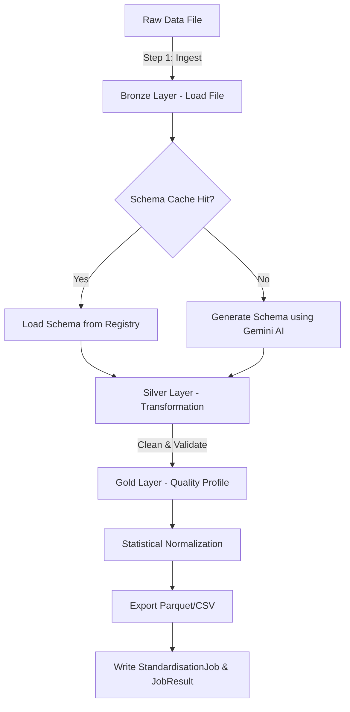

# 🛠️ AfriData – Schema Fingerprint Standardisation Engine

This document provides a guide to the architecture, multi-layer ETL pipeline, and database models of the **AfriData Standardisation Engine** (`standardiser/` and `pipeline_lib/`).

---

## 📌 Architectural Overview

The standardisation engine automates column matching, cleans data anomalies, validates format constraints, and saves standardized outputs. It uses **Polars** for memory-efficient, fast execution.



---

## 🧱 Repository Structure

* **`pipeline.py` (Root wrapper)**: Entry point exposing `process_dataset(...)`.
* **`pipeline_lib/` (Core library)**:
  * `loader.py`: Handles multi-format data ingestion (CSV, Excel, JSON, Parquet, XML, YAML) into a Polars DataFrame.
  * `schema.py`: Compares raw columns against standards using Jaccard index similarity; falls back to LLM matching.
  * `cleaning.py` & `advanced_cleaning.py`: Normalizes values, removes duplicates, and filters nulls.
  * `validation.py`: Performs outlier analysis, pattern matching, and type validations.
  * `normalization.py`: Applies automatic Z-score scaling, log transformations, or encoding.
  * `registry.py`: Reads and writes schemas in `schema_registry.json`.
  * `reporting.py`: Generates the final Quality Report.
* **`standardiser/` (Django tracking application)**:
  * `models.py`: Defines Django tables that monitor jobs, cache pipeline schemas, track user changes, and record execution logs.

---

## 🔄 The Bronze ➔ Silver ➔ Gold Pipeline

### 1. Bronze Layer (Ingest)
* Raw data is loaded into memory using `pipeline_lib.loader`. 
* Polars `LazyFrame`/`DataFrame` objects are used instead of Pandas to ensure rapid parsing of heavy datasets with minimal CPU usage.

### 2. Silver Layer (Standardize & Clean)
* **Schema Matching**:
  * **Fast Path**: Checks the registry for an exact match by comparing raw columns using **Jaccard Similarity** index.
  * **Fallback Path**: Calls Gemini AI to analyze the columns, map them to official standards, and predict confidence levels.
* **Data Cleaning**:
  * Nulls in key columns are removed or filled.
  * Duplicates are scrubbed.
  * Character strings are normalized.

### 3. Gold Layer (Validate, Normalise & Profile)
* **Validations**: Outlier check via standard deviation / IQR, data types match standards, ISO date/code formats match patterns.
* **Statistical Normalization**: Optional Z-score normalization or log scaling for machine-learning-ready datasets.
* **Quality Report**: Calculates a final **Mapping Quality Score** using the formula:
  
  $$\text{Mapping Score} = 100 - \left( \frac{\text{Total Validation Issues}}{\text{Total Columns}} \times 100 \right)$$

---

## 🛢️ Pipeline Database Tracking

When run within the Django web application, execution state is recorded in the following models:
1. **`StandardisationJob`**: Tracks job states (`pending`, `processing`, `completed`, `failed`, `review`).
2. **`JobResult`**: Caches generated schemas, column mappings, validation errors, and output Parquet/CSV file paths.
3. **`SchemaMappingEdit`**: Records manual user overrides to AI column mappings, allowing jobs to be rerun with updated parameters.
4. **`DatasetVersion`**: Saves historical states of the dataset schemas for version control.
5. **`ProcessingLog`**: Step-by-step diagnostic logging (Info, Warning, Error) with timing.

---

## ✅ Developer Checkpoints & Verification

- [ ] **Polars Immutable Paradigm**: Ensure you never modify dataframes in-place. Always return a modified clone (e.g. `df = df.with_columns(...)`).
- [ ] **Verify Registry Backends**: In development, check that schemas are written to `schema_registry.json`.
- [ ] Run the test suite:
  ```bash
  python manage.py test standardiser
  ```

> [!WARNING]
> Keep the main orchestrator loop in `pipeline.py` clean. All custom transformation code must reside inside `pipeline_lib/` to keep the codebase modular.
